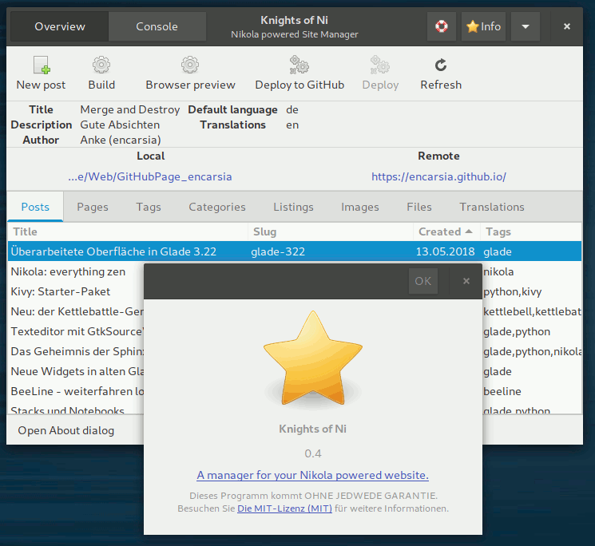

### WHAT IS THIS?

 * a simple GTK+ tool for keeping an eye on your Nikola powered website
 
### WHAT CAN I DO WITH IT?

 * have an overview of posts, pages, listings, images, files and translations
 * open files from app
 * keep track of changes made since last build (hint: **bold**)
 * create new posts and pages
 * build, preview and deploy to GitHub or GitLab or a custom target¹
 * create translation file on right click in the 'Translation' tab
 * bookmark and switch between different Nikola site instances (rudimentary feature)
 * integrated terminal for switching easily between GUI and commandline interface

¹ For deploying to GitLab the `nikola github_deploy` command is used. See this [Example Nikola site using GitLab Pages](https://gitlab.com/pages/nikola) for details on how to setup your Nikola configuration. The second "Deploy" toolbutton is active if you setup `DEPLOY_COMMANDS` in your `conf.py` and will execute the _default_ preset.

### WHAT CAN'T I DO WITH IT?

 * create a Nikola site
 * pretty much anything else, too

### WHAT DO I NEED TO GET IT WORKING?

 * Python 3
 * [Nikola](https://getnikola.com/) installation (latest tested version is 7.8.15)
 * configurated Nikola site ([Getting Started](https://getnikola.com/getting-started.html))
 * Python GObject Introspection bindings ([PyGObject](http://pygobject.readthedocs.io/en/latest/getting_started.html))
 * [PyYAML](https://github.com/yaml/pyyaml)

### INSTALLATION

 * download and extract or clone repository and change into said folder
 
### ARE WE THERE YET?

 * change into the `non` folder and execute `non.py`
 * if you intend to use the desktop icon, edit `data/non.desktop` and customize path of "Exec", and "Icon" and copy file to `~/.local/share/applications/`

### I'M LAZY!

 * run `python setup.py install --user` to install the app just for your selfish self or
 * run `python setup.py install` with administrator privilege for system-wide installation
 * press the <kbd>SUPER</kbd> key and start typing <kbd>N</kbd>...<kbd>O</kbd>...<kbd>N</kbd> 
 * press <kbd>ENTER</kbd> if you spot the duck

### HOW DO I GET RID OF THIS?

 * Lucky you asked. If you installed the application via `setup.py`, run `python setup.py uninstall --user` or `python setup.py uninstall` (with superuserpowers) to undo the installation. This will remove the Python package and any desktop files.

### THAT SOUNDS PRETTY BASIC. ANY PLANS FOR THE FUTURE ON THIS?

 * My view on this project is quite selfish: I'm trying to improve my skills by writing stuff I intend to use.
 * Besides this there are some ideas for further features such like
    * an integrated ReST editor
    * provide personal article templates
 * Roadmap:
    * improve speed and reduce file accesss by storing metadata as JSON or some other crazy shit
    * stats on size/articles/pages/installed themes and plugins
    * give the bookmark feature some love

### WHAT DOES IT LOOK LIKE? 

