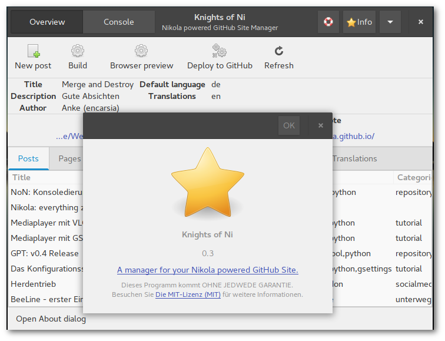

WHAT IS THIS?

 * a simple GTK+ tool for keeping an eye on your Nikola powered GitHub Page
 
WHAT CAN I DO WITH IT?

 * have an overview of posts, pages, listings, images, files and translations
 * open files from app
 * keep track of changes made since last build (hint: **bold**)
 * create new posts
 * build, preview and deploy to GitHub
 * create translation file on right click in the 'Translation' tab

WHAT CAN'T I DO WITH IT?

 * create a Nikola site
 * pretty much anything else, too

WHAT DO I NEED TO GET IT WORKING?

 * [Nikola](https://getnikola.com/) installation
 * configurated Nikola site
 * Python 3 including GObject Introspection bindings

THAT SOUNDS PRETTY BASIC. ANY PLANS FOR THE FUTURE ON THIS?

 * My view on this project is quite selfish: I'm trying to improve my skills by writing stuff I intend to use.
 * Besides this there are some ideas for further features such like
    * an integrated ReST editor
    * a bookmark function for easy handling of multiple Nikola sites
    * deploy to any other site than GitHub
    * provide templates

