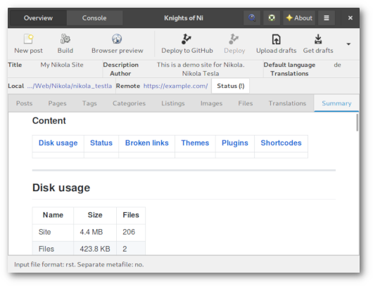

### WHAT IS THIS?

 * a simple GTK+ tool for keeping an eye on your Nikola powered website
 
### WHAT CAN I DO WITH IT?

 * have an overview of posts, pages, listings, images, files and translations
 * open files from app
 * keep track of changes made since last build (hint: **bold**)
 * create new posts and pages (in default ReST format)
 * build, preview and deploy to GitHub or GitLab or a custom target¹
 * create translation file on right click in the 'Translation' tab
 * bookmark and switch between different Nikola site instances (beta feature)

¹ For deploying to GitLab the `nikola github_deploy` command is used. See this [Example Nikola site using GitLab Pages](https://gitlab.com/pages/nikola) for details on how to setup your Nikola configuration. The second "Deploy" toolbutton is active if you setup `DEPLOY_COMMANDS` in your `conf.py` and will execute the _default_ preset.

### WHAT ELSE IS THERE TO SEE?

 * integrated terminal for switching easily between GUI and commandline interface
 * in the 'Summary' tab there are some detailed information about the Nikola site like disk usage, available and installed themes or plugins (beta feature)
 
### WHAT CAN'T I DO WITH IT?

 * create a Nikola site
 * pretty much anything else, too

### WHAT DO I NEED TO GET IT WORKING?

 * Python 3
 * [Nikola](https://getnikola.com/) installation
   * latest tested versions are 7.8.15 and 8.0.0
   * consult the [upgrade guide for v8](https://getnikola.com/blog/upgrading-to-nikola-v8.html), this code piece cannot help you with that but also is not affected by it 
 * configurated Nikola site ([Getting Started](https://getnikola.com/getting-started.html))
 * Python GObject Introspection bindings ([PyGObject](http://pygobject.readthedocs.io/en/latest/getting_started.html))
 * [PyYAML](https://github.com/yaml/pyyaml)
 * [Python-Markdown](https://python-markdown.github.io)

### INSTALLATION

 * download and extract or clone repository and change into said folder
 
### ARE WE THERE YET?

 * change into the `non` folder and execute `non.py`
 * if you intend to use the desktop icon, edit `data/non.desktop` and customize path of "Exec", and "Icon" and copy file to `~/.local/share/applications/`

### I'M LAZY!

 * run `python setup.py install --user` to install the app just for your selfish self or
 * run `python setup.py install` with administrator privilege for system-wide installation
 * press the <kbd>SUPER</kbd> key and start typing <kbd>N</kbd>...<kbd>O</kbd>...<kbd>N</kbd> 
 * press <kbd>ENTER</kbd> if you spot the duck

### HOW DO I GET RID OF THIS?

 * Lucky you asked. If you installed the application via `setup.py`, run `python setup.py uninstall --user` or `python setup.py uninstall` (with superuserpowers) to undo the installation. This will remove the Python package and any desktop files.

### ANYTHING ELSE I SHOULD KNOW?

 * application related files are stored in `~/.non`:
   * `config.yaml` for current Nikola site and bookmarks, editing or deleting does not affect any actual local Nikola site 
   * `non.log` for the type of persons who stick their noses into everything
 * if you want to edit or delete bookmarks you have to edit the config file (`.non/config.yaml`)
 * the summary page is generated if a ``conf.py`` is loaded for the first time or invoked by the corresponding menu item because the task may take some time; it is a HTML file with [GitHub flavoured css](https://github.com/sindresorhus/github-markdown-css)

### THAT SOUNDS PRETTY BASIC. ANY PLANS FOR THE FUTURE ON THIS?

 * My view on this project is quite selfish: I'm trying to improve my skills by writing stuff I intend to use.
 * Besides this there are some ideas for further features such like
    * an integrated ReST editor
    * provide personal article templates
 * Roadmap:
    * upgrade GUI to GTK 3.24
    * give the bookmark feature some love

### WHAT DOES IT LOOK LIKE? 

#### MAIN WINDOW

#### INTEGRATED CONSOLE

#### SUMMARY TAB

