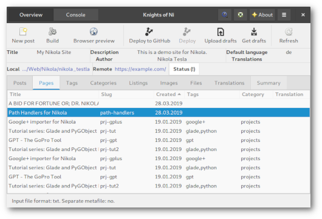

### WHAT IS THIS?

 * a simple GTK+ tool for keeping an eye on your Nikola powered website(s)
 
### WHAT CAN I DO WITH IT?

 * have an overview of posts, pages, listings, images, files, translations and site statistics
 * open files from app or load article in a browser on right click
 * keep track of changes made since last build (hint: **bold**)
 * create new posts and pages
 * if configured the application detects different input markup (reStructuredText, Markdown, ...)
 * build, preview and deploy to GitHub or GitLab or a custom target¹
 * create translation files on right click in the 'Translation' tab
 * bookmark and switch between different Nikola site instances
 * search for strings in posts, pages and listings


¹ For deploying to GitLab the `nikola github_deploy` command is used. See this [Example Nikola site using GitLab Pages](https://gitlab.com/pages/nikola) for details on how to setup your Nikola configuration. The second "Deploy" toolbutton is active if you setup `DEPLOY_COMMANDS` in your `conf.py` and will execute the _default_ preset.

### WHAT ELSE IS THERE TO SEE?

 * integrated terminal for switching easily between GUI and commandline interface
 * in the 'Summary' tab there are some detailed information about the Nikola site like disk usage, available and installed themes or plugins (beta feature)
 * this application is ready for localization ([POT file](ui/NoN.pot)); add your translation and open a PR if you like (only German translation available yet)

### WHAT CAN'T I DO WITH IT?

 * create a Nikola site

### WHAT DO I NEED TO GET IT WORKING?

 * Python 3
 * [Nikola](https://getnikola.com/) installation
   * latest tested versions are 7.8.15 and 8.2.0
   * consult the [upgrade guide for v8](https://getnikola.com/blog/upgrading-to-nikola-v8.html), this code piece cannot help you with that but also is not affected by it
 * configurated Nikola site ([Getting Started](https://getnikola.com/getting-started.html))
 * Python GObject Introspection bindings ([PyGObject](http://pygobject.readthedocs.io/en/latest/getting_started.html))
 * [PyYAML](https://github.com/yaml/pyyaml)
 * [Python-Markdown](https://python-markdown.github.io/) for Python 3
 * recommended: Git (probably already installed)
 * [ghp-import](https://pypi.org/project/ghp-import/): deploy to GitHub Pages
 * if you plan an installation: [setuptools](https://github.com/pypa/setuptools) and [pip](https://pip.pypa.io/en/stable) (probably already installed)

#### PREPARE ARCHLINUX AND ITS RELATIVES

The PyGObject Introspection bindings are probably already installed (tested with a plain Openbox and MATE desktop).

``` bash
sudo pacman -S python-yaml python-setuptools python-ghp-import
```

#### PREPARE UBUNTU 21.04

``` bash
sudo apt-get install python3-gi gir1.2-webkit2-4.0 gir1.2-vte-2.91 python3-pip python3-setuptools python3-setproctitle git
```

### INSTALLATION

> FTR: when executing `python`, it is Python 3

 * If you plan on testing NoN you probably have Nikola already installed. There are plenty ways to do so. Nonetheless Nikola will be installed as a dependency during the installation of NoN via pip.

 * clone the [repository](https://github.com/encarsia/non) and change into said folder
 * run `pip install .` for a user-wide installation, run the command with root privileges to install system-wide

or

 * run `pip install git+https://github.com/encarsia/non.git` without prior repo cloning

 
### ARE WE THERE YET?

 * press the <kbd>SUPER</kbd> key and start typing <kbd>N</kbd>...<kbd>O</kbd>...<kbd>N</kbd> 
 * press <kbd>ENTER</kbd> if you spot the duck

### HOW DO I GET RID OF THIS?

 * Lucky you asked. It's as easy as the installation, just run `pip uninstall non` and you're done.

### ANYTHING ELSE I SHOULD KNOW?

 * application related files are stored in `~/.non`:
   * `config.yaml` for current Nikola site and bookmarks, editing or deleting does not affect any actual local Nikola site 
   * `non.log` for the type of persons who stick their noses into everything
   * `path_to_nikola_site.json` stores all data (posts/pages with metadata, listings, tags etc. of a site, one file per site
   * `path_to_nikola_site.html` contains the page shown in the 'Summary' tab, one file per site
 * if you want to edit or delete bookmarks you have to edit the config file (`~/.non/config.yaml`); you can open the file from the preferences menu
 * the summary page is generated if a ``conf.py`` is loaded for the first time or the task is invoked by the corresponding menu item; it is a HTML file with [GitHub flavoured CSS](https://github.com/sindresorhus/github-markdown-css); generating the summary may take some time
 * if you load data from a Nikola site for the first time the application indexes the content and saves it as a JSON file in the `~/.non` folder and only updates on every next startup; this initial task may take some time depending on the size if the site - just be patient

### THAT SOUNDS PRETTY BASIC. ANY PLANS FOR THE FUTURE ON THIS?

 * My view on this project is quite selfish: I'm trying to improve my skills by writing stuff I intend to use.
 * Besides this there are some ideas for further features such like
    * an integrated reST editor
    * provide personal article templates by using the ``-i`` option of the ``new_post`` command


### WHAT DOES IT LOOK LIKE? 

#### MAIN WINDOW



#### INTEGRATED CONSOLE


#### SUMMARY TAB


#### SEARCH


### SOURCES AND LICENSES

* application: [The MIT License](LICENSE.md)

* icon: [Ducky icon](https://openclipart.org/detail/22535/ducky-icon), released into the [Public Domain](https://openclipart.org/share)
